# Motion

Motion is one of the fundamental concept that must be understood well in order to have a better grasp of more complex processes and concepts. In this chapter we cover one of the fundamental mathematical structures we use to express most forms of motion, the *vector*. We'll also cover position, velocity, and acceleration which are all the forms of motion you're likely most familiar with. Finally, we will briefly cover frequency and all of it's interpretations that we'll have in robotics.

## Position

#### Coordinates System
Position most notably expressed in cartesian coordinates which are the standard x-y graphs you use in algebra and other math classes. The position of a point is expressed by what we refer to as an *ordered pair* which looks like this: `(x, y)`. It's called an ordered pair because it has a pair (two) of numbers and the order of these numbers is what designates what the number represents. In traditional cartesian coordinates, we put the `x` before the `y` which means when we see an ordered pair like this, `(5, 23)` we know that the number 5 expresses where the number lies on the `x` axis and 23 represents where the point is in relation to the `y` axis.

----

## Vectors
Vectors are quantities that have both a magnitude and direction. Visually, vectors are represented by arrows with the direction of the arrow being the vector's direction and the length of the arrow tip to tail is the magnitude of the vector. Examples of vectors and their applications in robotics include: velocity, force, acceleration, or even relative distances. You will be using vectors the most in hardware when analyzing multiple forces acting on an object. They'll become extremely useful when making system force and load diagrams and they'll create a good foundation for understanding things like projectile motion when it comes to designing shooter assemblies. Overall, vectors may seem like a very disconnected abstract concept now, but in later sections, you'll see how utilized they are.

Before beginning learning about vectors, I recommend you make sure you're familiar with trig functions (sine, cosine, tangent) as well as the [Pythagorean theorem](https://www.khanacademy.org/math/basic-geo/basic-geometry-pythagorean-theorem/geo-pythagorean-theorem/v/the-pythagorean-theorem).

<a href="https://www.youtube.com/watch?v=zb1KHxpoDPQ" rel="" target="_blank">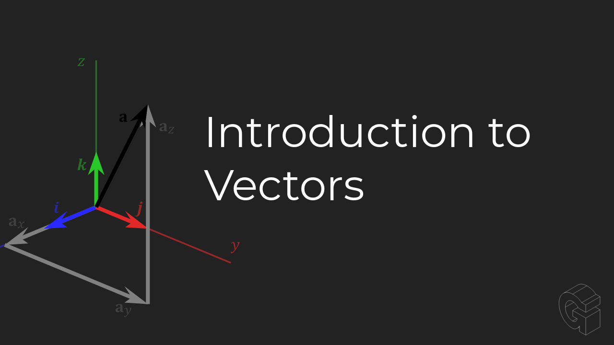</a>

Learning how to compute the product of a vector and scalar will become useful when trying to account for things like friction. Friction will be covered more in a later section but the quantitative measurement of static, kinetic, and rolling friction is a coefficient based on forces acting on a material. So in cases where we account for friction in a calculation, we will be finding the product of a scalar quantity (the coefficient of friction) and a vector quantity (the normal force vector).

Especially in force diagrams, vector addition is crucial. It's the most straightforward way of computing how an assembly, part, or object, will react to multiple forces exerted on the object. It will help when computing the tension applied to cables at angles as well. So using vector addition, we would have the power to compute the total estimated tension on a cable to make sure the speced cable will not break. Vector addition is extremely useful to learn early. And it's also very simple. Just add each respective component of the vector. 

<a href="https://www.youtube.com/watch?v=qGZsCMY8rZU" rel="" target="_blank">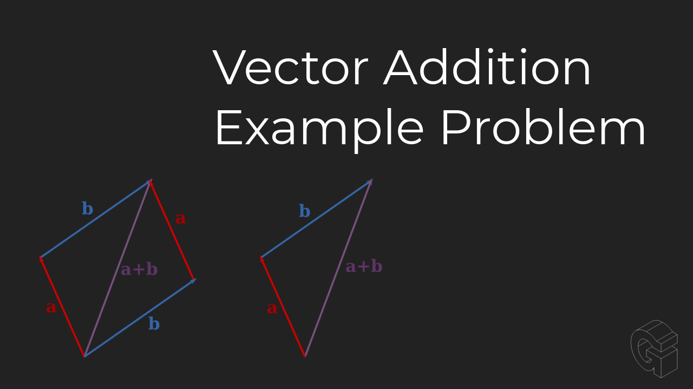</a>

<a href="https://www.youtube.com/watch?v=G7qeyvbHeSc" rel="" target="_blank">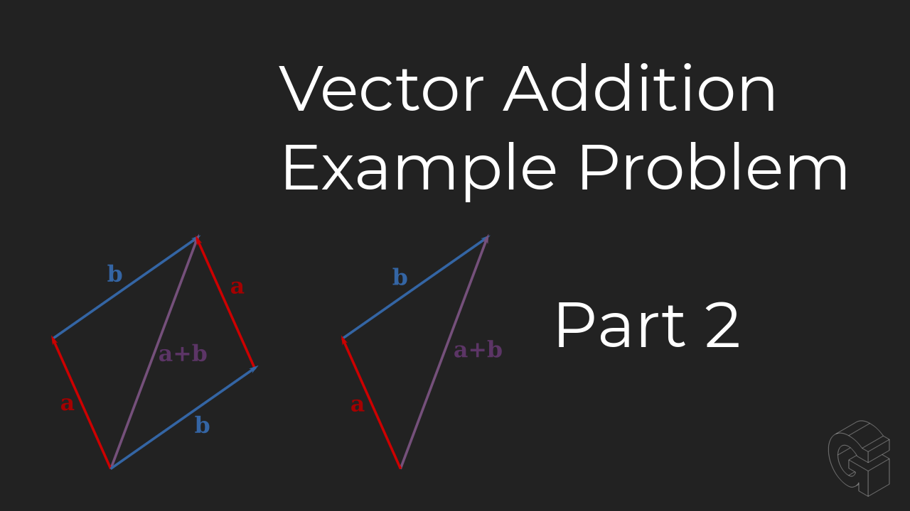</a>

A **Unit Vector** is a vector that can be computed for every vector. It has the same direction as it's parent vector, but will always have a magnitude of one. This makes it in a lot of ways similar to the unit circle which is a circle of radius 1. Unit vectors can be used to see if two vectors have the same direction. If two vectors have the same direction, they will have the exact same unit vector.

<a href="https://www.youtube.com/watch?v=Sg2dvbBs9YM" rel="" target="_blank">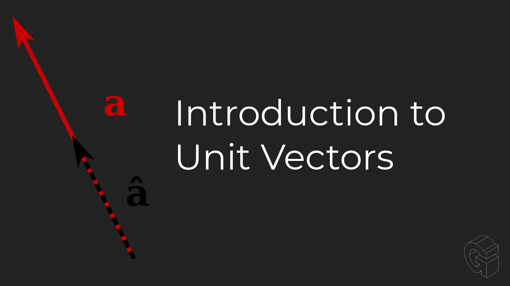</a>

Even though 2D vectors will be sufficient for most of what we'll cover, it's important to understand that vectors can be any any number of dimensions and that when designing robots, we're designing in a 3D spacial domain. Thinking about things in 3D is really important for developing a good mental model of the world. 

<a href="https://www.youtube.com/watch?v=2TO1CQpMOKA" rel="" target="_blank">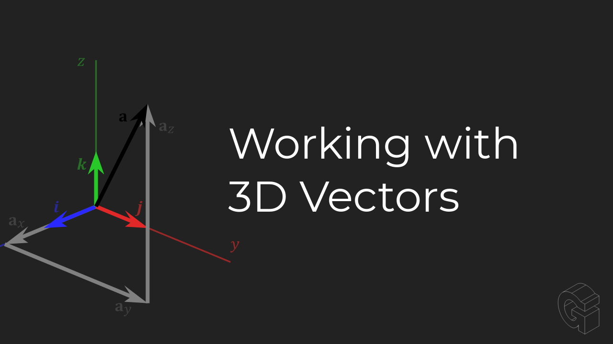</a>

On a final note, I highly recommend you watch the entire ["Essence of Linear Algebra"](https://www.3blue1brown.com/essence-of-linear-algebra-page) series by 3Blue1Brown. If you do this, you'll earn a very fundamental understanding of vectors and it'll change your life.

#### Additional Resources:
- [Vectors, what even are they? | Essence of linear algebra, chapter 1](https://www.youtube.com/watch?v=fNk_zzaMoSs)
- [Vectors and Direction](https://www.physicsclassroom.com/class/vectors/Lesson-1/Vectors-and-Direction)
- [Vector intro for linear algebra](https://www.khanacademy.org/math/linear-algebra/vectors-and-spaces/vectors/v/vector-introduction-linear-algebra)
- [Euclidean vector](https://www.wikiwand.com/en/Euclidean_vector)
- [Brown University Vectors Tutorial](https://www.brown.edu/Departments/Engineering/Courses/En4/Tutorials/Vector_Tutorial.pdf)
- [Essence of Linear Algebra | 3 Blue 1 Brown](https://www.3blue1brown.com/essence-of-linear-algebra-page)

---

## Velocity

Velocity is a vector quantity that represents the rate at which something is traveling in distance per unit time. Because velocity is a vector, it has a magnitude and direction. An example of a velocity would be *"The robot is traveling 12 ft per second northbound."* In this case, the magnitude of the velocity vector is `12 ft per second` and the direction is northbound. If we were only to specify the magnitude of this vector, we would call it speed instead of velocity. So saying *"the ball is flying 2 meters per second"* would be expressing the speed of the ball. We would need to specify a direction in order for it to be a velocity vector.

### Angular Velocity

Angular velocity is a quantity that describes circular motion. It describes the rate of circular motion to be precise. Some possible units of angular velocity are `radians per second`, `revolutions per minute` *(RPM)*, `degrees per second`. Really any unit of "turning" (angular unit) per unit of time is an angular velocity. In the case of angular velocity, the direction is going to be either clockwise or counterclockwise. Which can be expressed by positive or negative numerical expressions of angular velocity.

<a href="https://www.youtube.com/watch?v=RMg7ZwYaPIM" rel="" target="_blank">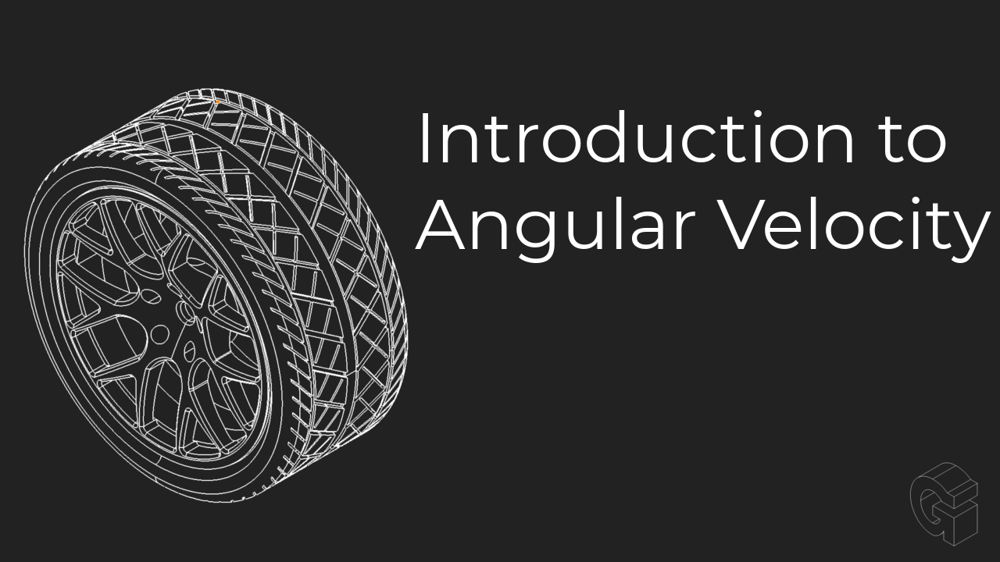</a>

One of the most prolific uses for angular velocity in FRC is in the analysis of wheel speed and how that will relate to the overall motion of the robot chassis across the field. The math and concepts you learn in this section will help when learning how to spec gearboxes and motors for a drivetrain because this teaches the relationship between angular velocity of a wheel and chassis velocity. Later you'll learn how to calculate the angular velocity of a wheel on a drivetrain given the motor and gearbox constraints.

<a href="https://www.youtube.com/watch?v=lO5Kheoe0KY" rel="" target="_blank">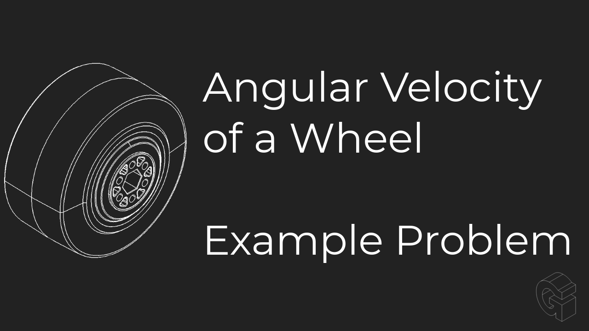</a>

Another common use for angular velocity in FRC would be calculating how fast an assembly that is fixed to a belt would travel given the angular velocity of the pulley driving the belt. You can imagine this becoming useful if you have a target speed for a belt driven linear assembly and you want to reduce the load on the motor as much as possible so you'd want to find the highest reduction to achieve the desired linear speed. The relationship between angular velocity of a pulley and linear velocity of a belt is crucial for these assemblies.

<a href="https://www.youtube.com/watch?v=Z--5wroyVh0" rel="" target="_blank">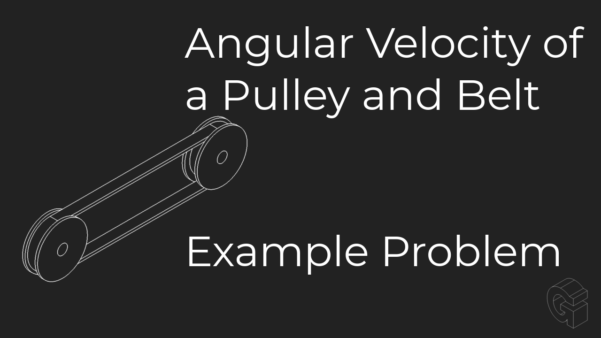</a>

Another use case for angular velocity of the drive train wheel would be to compute the heading angular velocity based on the wheel speed. You should also be able to compute the angle at a specific timestamp given the wheel angular velocity and some data about the chassis. 

<a href="https://www.youtube.com/watch?v=MWCk_umEnHY" rel="" target="_blank">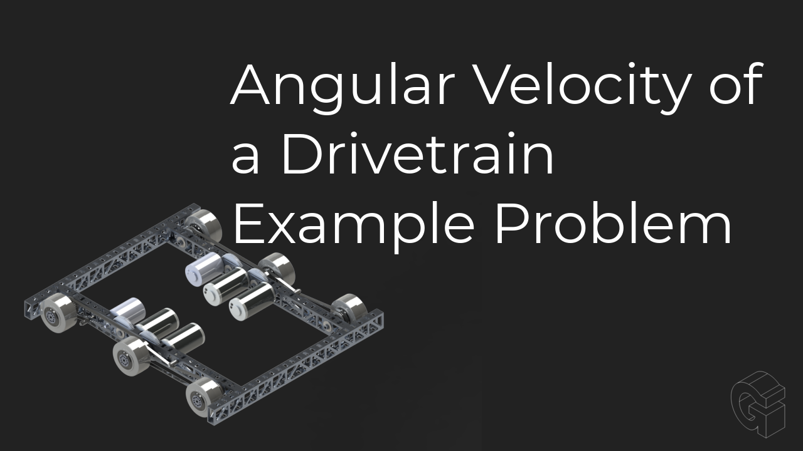</a>

----

## Acceleration

Acceleration is the the rate at which velocity is changing with respect to time. Because velocity is a vector and acceleration is base on the change in velocity, acceleration itself is a vector quantity. `a = v/t` where v is the change in velocity and t is the change in time. The units for acceleration is distance per square unit of time. Some people may be confused by the square unit of time in the denominator. But a better way of thinking about this may be more linguistic. Instead of thinking about an acceleration being *"the object is accelerating 10 meters per second squared"* think of it as *"the object's velocity is increasing 10 meters per second every second"* So if the object starts at rest, after one second, the velocity would be 10 meters per second. After two seconds the velocity would be 20 meters per second. After 3 seconds, 30 meters per second. So you can see that the velocity is changing when time is elapsing and that is exactly what acceleration is. Acceleration is the change in velocity with respect to a change in time. This is just the same as velocity being the change in distance with respect to the change in time except it's one step further because we're analysing the change in velocity not just the change in distance. 

<a href="https://www.youtube.com/watch?v=W_2xBB1_yp0" rel="" target="_blank">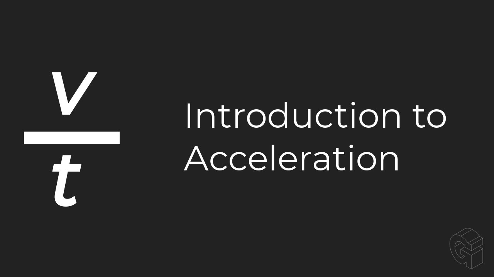</a>

This example covers using the known acceleration of a chassis to calculate the angular velocity of the wheel. (commonly called wheel speed)

<a href="https://www.youtube.com/watch?v=8Jb71SJjSiU" rel="" target="_blank">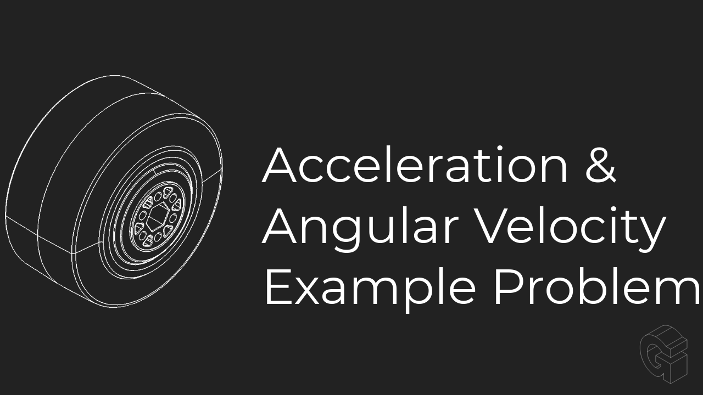</a>

----

## Frequency

Frequency is a very important concept to grasp in robotics. It'll be used in a variety of applications from AC electricity, to processor speeds, to resonant frequencies, to any general repeated motion. This video briefly goes over the basic units of frequency, Hertz (Hz). And how it's basically "how many time something occurred per second" which can also be interpreted as inverse seconds.

<a href="https://www.youtube.com/watch?v=4ddqRB-wQ7w" rel="" target="_blank">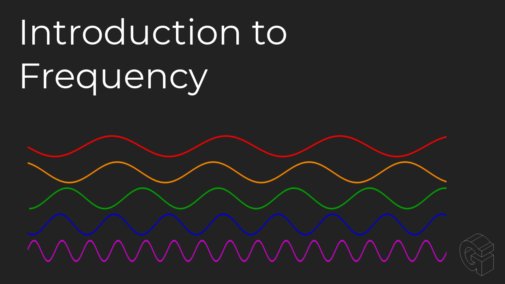</a>

----

## Practice Problems

----